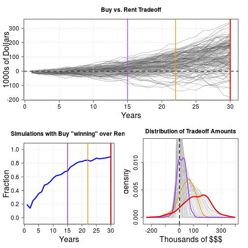

## What is it and why we want it

The _Buy vs. Rent_ question confuses countless people daily.   
We seek help online, being almost invariably mislead by over-simplistic tools.

The plethora of calculators found on the web in the majority of cases 
do not properly handle several important aspects of the cost/benefit analysis
of buying vs. renting. 

For instance:

* tax-related items, namely the tax benefits of the mortgage interest deduction, also considering 
the fact that applying it means itemizing deductions, hence losing the _standard deduction_.
* the benefits of re-investing money potentially saved by renting instead of buying,
* the benefit of the return of investment of the capital not put into a down-payment.

[This calculator](https://pedrosan.shinyapps.io/buy_vs_rent/) implements a more comprehensive 
and realistic picture, including these and other ingredients, and yields 
a __statistical assessment__ of the __buy vs. rent__ question __by means of simulations__.

--- 

## A Simulations-based Approach

Given a set of input parameters, 250 simulations are performed, with stochastic "predictions" 
of time variation of: 

* property appreciation, 
* return of investment of the "unused cash" when renting,
* inflation, 
* rent increase (over inflation).

For the first three, values are drawn from Normal distributions with means and standard deviations
given among the application inputs. 
The additional rent increase rate is drawn from an exponential distribution.

For each simulation a "trade-off" amount (_i.e._ the difference between buying and renting) 
for each year, for the duration of the mortgage loan.

--- 

## Application Results

The simulations results are summarized in three plots showing:

1. the trends of the 'tradeoff' amount, 
2. the fraction of simulations favoring buying over renting, over time,
3. the distribution of tradeoff amounts over time, highligthing the distributions 
at 1/2, 3/4 and at the end of the loan period.

An example is shown in the final slide.
The plot is made on-the-fly by _slidify, with the full code which is hidden with `echo=FALSE`.

---

## Example of Summary Plot

 
