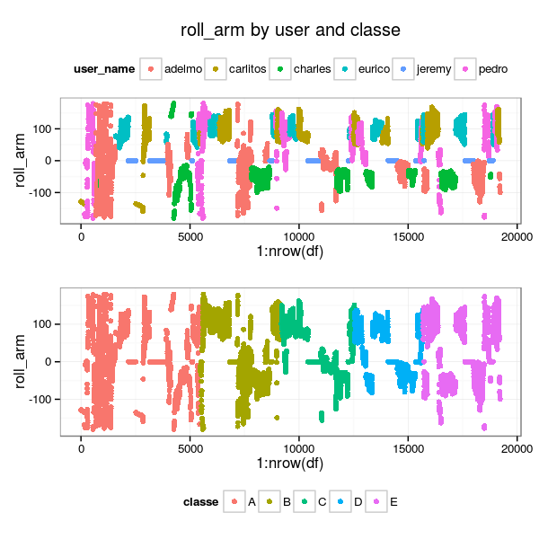
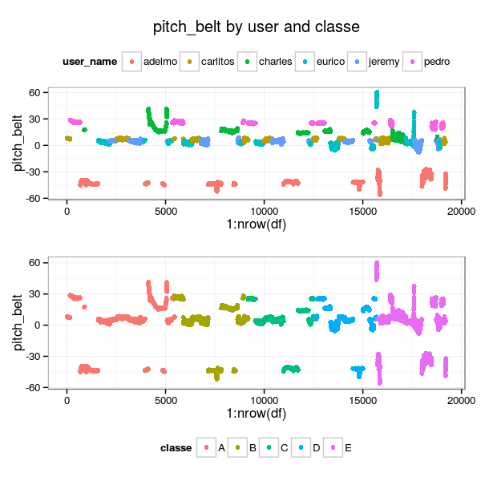
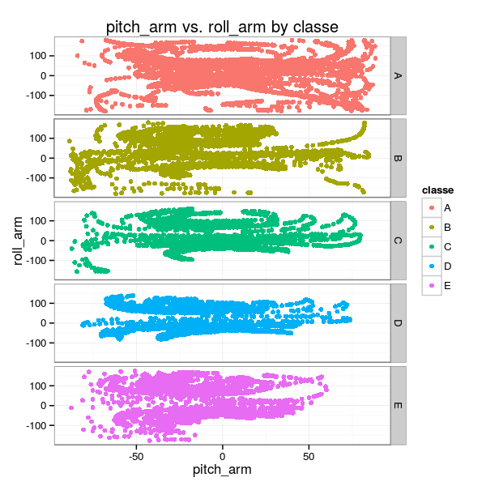
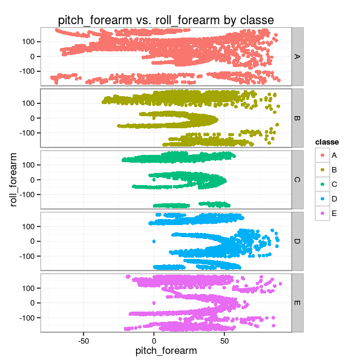
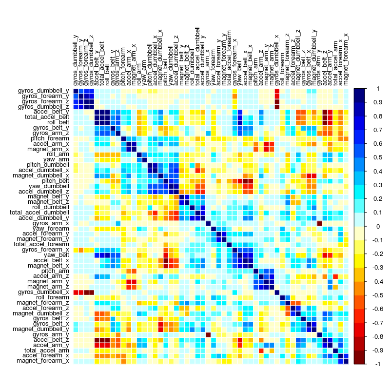
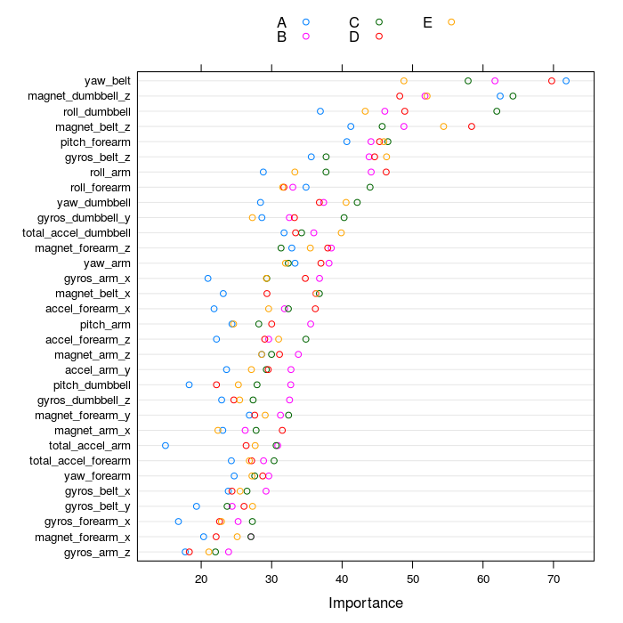
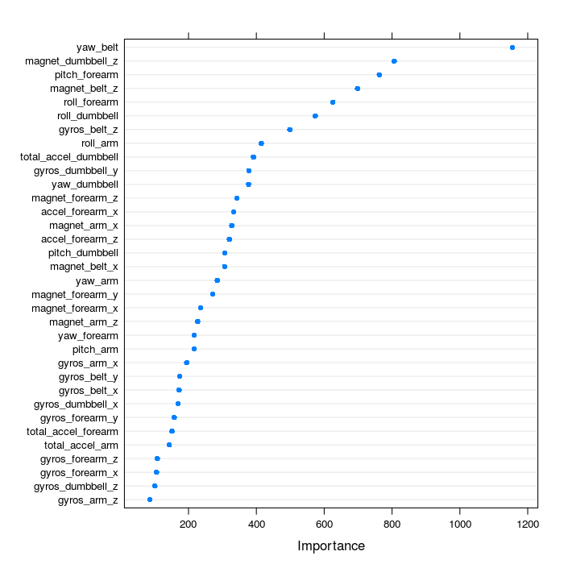
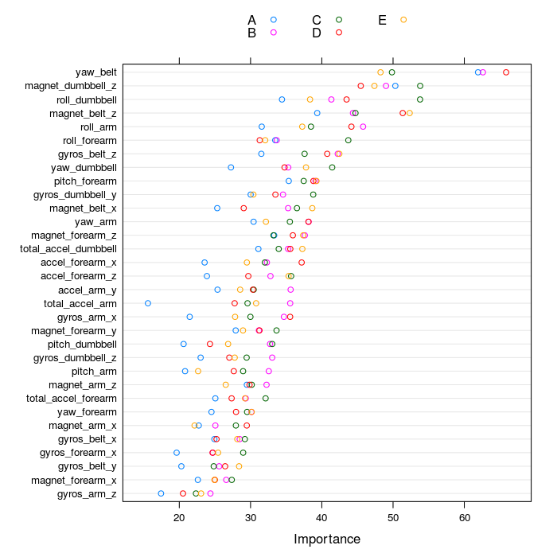

# Machine-Learning-based Assessment of The Quality of Weight-lifting Exercises
Giovanni Fossati  


## PREAMBLE

Report for the first assignment of the [_Practical Machine Learning_](https://www.coursera.org/course/predmachlearn)
course of the _Coursera/JHSPH Data Science Specialization_.

The source files are posted on [GitHub](https://github.com/pedrosan/DS_specialization/tree/master/ML)


## INTRODUCTION

The rapid diffusion of sensors able to record physical parameters associated with motion (_e.g._ accelerometers),
in dedicated devices and more importantly in general consumer electronics available/used by a broader population
has sparked a great interest in developing applications taking advantage of these motion-related data.
One area of particular interest concerns fitness-related activities.

This report summarizes the results of the development, and testing, of a _Machine Learning_ model able
to recognize the _quality_ of a simple weight lifting exercise, namely whether
or not it was performed appropropriately (and hence safely and effectively).

We used the dataset put together by the [research group on Human Activity Recognition](http://groupware.les.inf.puc-rio.br/har)
at the PUC of Rio de Janeiro.


<a name="SUMMARY"></a>

## SUMMARY OF RESULTS

We tested three types of ML algorithms, all _tree-based_ methods: _CART_ trees, _boosted_ trees, and _random forest_.

The first two methods failed to yield high quality results.
This may have been caused by less than ideal choice of parameters, although in most cases
we run them with the default values from `caret`, which are expected to be 
reasonable for decent results.   

__Random forest__ models produced high quality results, with accuracies
exceeding 99%, both in the built-in _Out Of the Bag_ resampling, and on our
separate _testing_ subset.

Beside its clearly better performance, the choice of a random forest as an
ensemble method is supported by its ability to handle multi-class problems.

We ran _random forest_ models with __three different _internal_
cross-validation__ setups (implemented through the `trainControl()` function of `caret`):
* 4-fold Cross-Validation, 
* bootstrap, and 
* _Leave Group Out Cross Validation_.

As noted, the trained models achieved exceptional accuracy in the ability of predicting the _outcome_
variable `classe`, not only when tested against the 20-entries project benchmark, but more importantly
when tested against the portion (25%) of the full dataset that we set aside for __validation_.

The results of a _random forest_ model are not easily interpretable, even in
presence of physically/motion based predictors.
Nevertheless, as illustrated in some example plots, the data contain fairly clear pattern and differences
between categories of exercise quality, that can be related to the slight differences in the motion
of the body and weight dumbbell, and that are apparently very well picked out by the algorithm.


<hr class="thin_separator">
<a name="THE_DATA_SET"></a>

## THE DATA SET

The data for the project were made available from the Coursera ML course webpage.
Two separate sets were posted:

* [a _training_ dataset](https://d396qusza40orc.cloudfront.net/predmachlearn/pml-training.csv).  This set comprises a little over 16,000 entries for 160 variables.
* [a _testing_ dataset](https://d396qusza40orc.cloudfront.net/predmachlearn/pml-testing.csv), to be used as a final project benchmark, comprising 20 "anonymized" entries.

### Structure

The dataset comprises 160 variables:

* 152 actual _predictors_, _i.e._ the sensor data.
* 1 is the quality _class_ of the exercise (`classe`, taking values _A_, _B_, _C_, _D_, _E_).
* 7 are auxiliary variables: 
	* the _user_ name (`user_name`).
	* 3 time stamp related variables: `raw_timestamp_part_1`, `raw_timestamp_part_2`, `cvtd_timestamp`.
	* 2 _exercise window_ markers/counters: `new_window`, `num_window`.

### The sensor data

As described in the paper by Velloso et al. [REF], four _inertial measurement units_ (IMU) where setup, placed  
on _belt_, _arm_, _forearm_, _dumbbell_.
Each sensor measured 3-axes acceleration, gyroscope and magnetometer data at high cadence (45 Hz).
These data were processed to yield 13 timed variables for each sensor: 

* _total acceleration_.
* _roll_, _pitch_, _yaw_ angles.
* _x_, _y_, _z_ values for _gyroscope_, _acceleleration_, and _magnetometer_. 

For instance, for the _belt_ sensor the _basic timed data_ are: 
`total_accel_belt`, 
`roll_belt`, `pitch_belt`, `yaw_belt`, 
`gyros_belt_x`, `gyros_belt_y`, `gyros_belt_z`, 
`accel_belt_x`, `accel_belt_y`, `accel_belt_z`, 
`magnet_belt_x`, `magnet_belt_y`, `magnet_belt_z`.

The dataset therefore comprises $4 \times 13 = 52$ _basic timed data_.

In addition to these, several statistical summaries are computed and reported for each exercise _window_, for each sensor:

* For `total_accel`, its variance `var_accel`.
* For each of the three angles: `avg`, `stddev`, `var`, `kurtosis`, `skewness`, `max`, `min`, `amplitude` ($3 \times 8$ variables).

These $1 + 24 = 25$ statistical summaries for each sensor add another $100$ variables to the dataset for a total of $152$ variables.

It is worth emphasizing that the dataset presents _timed_ and _summary_ variables all together in one table.
While this may be practically convenient, it makes this dataset _un-tidy_ by combining variables of different nature.
Fortunately the two types of variables can be easily separated on the basis of the value of the `new_window` auxiliary variable,
which has value `no` for entries corresponding to timed data, and `yes` for their statistical summaries over each exercise window.


<hr class="thin_separator">
<a name="DATA_PREPARATION"></a>

## DATA PREPARATION

### Loading


```r
full <- read.csv("./data/pml-training.csv.gz", na.strings=c("#DIV/0!","","NA"), stringsAsFactors=FALSE)
full <- add_new_variables(full)
alt.full <- tidy_df(full)
```


```r
TEST <- read.csv("./data/pml-testing.csv.gz", na.strings=c("#DIV/0!","","NA"), stringsAsFactors=FALSE)
alt.TEST <- tidy_df(TEST)
```

### Cleaning/Tidying

#### Non-sensor variables

Some variables should be discarded because associated with very specific aspects of the 
experiment that should be irrelevant from the point of view of its goal, such as _window_ flags 
and _time stamps_.  
These are the excluded variables:  `X`,  `user_name`,  `new_window`,  `num_window`, 
`cvtd_timestamp`,  `raw_timestamp_part_1`,  `raw_timestamp_part_2`.

Beside their intrinsic irrelevance, keeping these in would likely strongly drive the results 
in a completely spurious and meaningless way, because for instance the algorithm may hook on the
`user_name` or `num_window`.


#### Individual measurements _vs_ _summaries_ : the `new_window` variable

To the best of my understanding, the dataset combines two different kinds of _observations_:

* single measurements of the main observables from the sensors, with some time cadence, and 
organized in _windows_, which are numbered (`num_window` variable).   
These data have `new_window == "no"`.
* statistical summaries of the measurements of each main observable over each _window_.   
These data have `new_window == "yes"`, and 

We restricted our analysis to the 52 variables representing individual _timed_ measurements, discarding the _summary_ data.


```r
alt.full <- subset(alt.full, new_window == "no")
alt.full.good <- select_proper_vars(alt.full)
alt.TEST.good <- select_proper_vars(alt.TEST)
alt.user <- alt.full$user_name
```

We also filtered out variables with `NA`, which basically means filtering against the _summary_ variables.


```r
# columns without ANY NA
alt.tt <- colSums(is.na(alt.full.good)) == 0

alt.full.select <- alt.full.good[, alt.tt]
alt.TEST.select <- alt.TEST.good[, alt.tt]
```


### Some exploratory plots

#### Features plotted vs. sequence index, and color coded by `user_name` and `classe`

These kind of plots shows that some of the features seem to correlated very strongly with the
_user_, even more than with their `classe`, somewhat oddly.

This suggest that the training to predict the quality parameter of the weight lifting exercise (`classe`) 
that we can achieve with this dataset may not be easily generalized.






#### Feature vs. Feature plots with separate panels by `classe`

This second set of example plots shows that there are indeed some reasonably recognizable patterns allowing to
distinguish between different `classe` categories.

The expectation is that the ML algorithm will be able to identify them and build on them a classification scheme.







<hr class="thin_separator">
<a name="FEATURE_SELECTION"></a>

## ABOUT FEATURE SELECTION

### Zero/low variance predictors

We checked the dataset for _un-informative_ predictors, namely variables taking (nearly) unique values or having 
very little variance in their values.    
The `caret` package provides a very convenient function to perform this quality-check, `nearZeroVar()`.  

None of the 52 features meets the criteria for exclusion on the basis of _near Zero Variance_.   
The full results of running it on our dataset (`nearZeroVar(alt.full.select, saveMetrics=TRUE)`) are reported
in the __Appendix__.


### _Collinearity_ between predictors

The presence of correlated predictor is undesirable because it can bias/mislead the modeling
and in any case it may lead to run a model with an unnecessarily large(r) number of predictors.
Although some ML algorithms are not negatively affected, it is generally safe to exclude
correlated pr edictors.   

For _tree-based_ models it is actually recommended to clean the data set of
correlated predictors because they end up sharing their overall _importance_,
thus appearing to be less significant than they actually are.

We took advantage of the `caret` function `findCorrelation()` to identify variables whose absolute
correlation value exceeds a set threshold (we chose 0.75) and obtain a list of variables to exclude
selected among those with high correlation. 

The actual predictors filtering was done applying this method just on the _training_ subset (see below).


<hr class="thin_separator">
<a name="DATA_SPLITTING"></a>

## DATA SPLITTING: "NEW" _TRAINING_ AND _TESTING_ SUBSETS

For validation purposes we split the full dataset in two subsets:

* a _training_ subset, comprising 75% of the data.
* a _testing_ subset, comprising 25% of the data.

__This _training_ / _testing_ split should not be confused with the original two datasets__, 
which unfortunately are named also _training_ and _testing_.  

We are splitting the original _training_ large dataset in two to be able to have
an independent validation of the models, beyond what may already be done internally
by some ML algorithms or by `caret` wrapped around them (_e.g._ by bootstrapping, or
the built-in randomization and subsetting of _random forest_ methods).


```r
seed.split <- 12468
set.seed(seed.split)
i.train.alt <- createDataPartition(y = alt.full.select$classe, p=0.75, list=FALSE)

alt.training <- alt.full.select[i.train.alt, ]
alt.testing <- alt.full.select[-i.train.alt, ]
```

### Feature selection on _training_ / _testing_ subsets

In the spirit of truly preserving the independence of the _testing_ data
subset, we performed the correlation-based feature reduction on the basis of
the correlation between variables computed on the _training_ subset instead of
the full dataset, and applied the same variables filtering to the _testing_ subset.


```r
# correlation filtering done on the training subset
alt.allCorr <- cor(alt.training[, -1])
i.fC.75.alt <- findCorrelation(alt.allCorr, cutoff=0.75)
```

The following plot shows the correlation matrix, with variables ordered on the basis of their _clustering_.


```r
corrplot(alt.allCorr, order="hclust", method="color", 
         col=color1(20), cl.length=21, tl.cex=0.8, tl.col="black", mar=c(1,1,1,0))
```



On the basis of their correlation, with a threshold of 0.75, these are the variables that would be excluded.


```r
# variables to be excluded
colnames(alt.training)[i.fC.75.alt+1]
#  [1] "accel_belt_z"      "roll_belt"         "accel_belt_y"      "total_accel_belt" 
#  [5] "accel_dumbbell_z"  "accel_belt_x"      "pitch_belt"        "magnet_dumbbell_x"
#  [9] "accel_dumbbell_y"  "magnet_dumbbell_y" "accel_dumbbell_x"  "accel_arm_x"      
# [13] "accel_arm_z"       "magnet_arm_y"      "magnet_belt_y"     "accel_forearm_y"  
# [17] "gyros_arm_y"       "gyros_forearm_z"   "gyros_forearm_y"   "gyros_dumbbell_x"

# variables selection
alt.training.cut75 <- alt.training[, -(i.fC.75.alt+1)]
alt.testing.cut75 <- alt.testing[, -(i.fC.75.alt+1)]
```


<hr class="thin_separator">
<a name="MODELING"></a>

## MODELING

We tested three types of ML algorithms, all within the framework provided by `caret`, and all
generally speaking _tree-based_ models.

* CART trees, namely `rpart2`.
* _boosted_ tree, namely `gbm`.
* _random forest_, namely `rf`.

The first two methods failed to yield high quality results, in fact in some cases their 
performance on the _testing_ subset was very poor.  
This may have been caused by less than ideal choice of parameters, but in most cases
we let the modeling run with the default values from `caret`, which are expected to be 
reasonable for decent results.   
We have to acknowledge that in some cases, in particular for the `gbm` models,
the running time turned out to be very long and the memory requirements large
enough to make it impractical, and we did not pursue those models more extensively.

On the other hand __random forest__ models produced high quality results, with
accuracies exceeding 99%, both in the built-in _Out Of the Bag_ resampling, and 
on our separate _testing_ subset.

In the next three sections we illustrate the results of __random forest__ models
run with __three different _internal_ cross-validation__ setups, implemented 
through the `trainControl()` function of `caret`:

* `cv`: Cross-Validation, 4-fold (_i.e._ 75%/25% splits).
* `boot` (the default): bootstrap, 25 repeats.
* 'LGOCV`: Leave Group Out Cross Validation, 25 repeats, 75%/25% train/test splits of the data.

In all cases we also tried a set of values for `mtry`, which regulates how many
predictors are selected in the _random forest_ random subsetting of variables.


### _Random Forest_ case 1 : 4-fold _CV_

With `mtry = 2, 6, 10, 18, 26, 34`.


```r
mtry.values <- c(2, 6, 10, 18, 26, 34)

ctrl.rf1c <- trainControl(method = "cv", number=4)

seed.rf1c <- 16790; set.seed(seed.rf1c)
mod.alt.rf1c <- train(x = alt.training.cut75[, -1], 
                      y = alt.training.cut75$classe, 
                      method = "rf", 
                      trControl = ctrl.rf1c,
                      tuneGrid = data.frame(mtry = mtry.values),
                      importance = TRUE, 
                      proximity = TRUE)
```

#### Fit Summary


```r
mod.alt.rf1c
# Random Forest 
# 
# 14414 samples
#    32 predictor
#     5 classes: 'A', 'B', 'C', 'D', 'E' 
# 
# No pre-processing
# Resampling: Cross-Validated (4 fold) 
# 
# Summary of sample sizes: 10811, 10810, 10811, 10810 
# 
# Resampling results across tuning parameters:
# 
#   mtry  Accuracy   Kappa      Accuracy SD  Kappa SD   
#    2    0.9898018  0.9870959  0.003951942  0.005002063
#    6    0.9911893  0.9888523  0.002982777  0.003774821
#   10    0.9901487  0.9875353  0.003060048  0.003872692
#   18    0.9879979  0.9848141  0.002999668  0.003797201
#   26    0.9830026  0.9784937  0.003199211  0.004049294
#   34    0.9777993  0.9719118  0.003413927  0.004319903
# 
# Accuracy was used to select the optimal model using  the largest value.
# The final value used for the model was mtry = 6.

mod.alt.rf1c$finalModel
# 
# Call:
#  randomForest(x = x, y = y, mtry = param$mtry, importance = TRUE) 
#                Type of random forest: classification
#                      Number of trees: 500
# No. of variables tried at each split: 6
# 
#         OOB estimate of  error rate: 0.61%
# Confusion matrix:
#      A    B    C    D    E  class.error
# A 4100    2    0    1    1 0.0009746589
# B   17 2762   10    0    0 0.0096808892
# C    0   19 2484   10    1 0.0119331742
# D    1    0   21 2337    2 0.0101651842
# E    0    0    1    2 2643 0.0011337868

mod.alt.rf1c$results
#   mtry  Accuracy     Kappa  AccuracySD     KappaSD
# 1    2 0.9898018 0.9870959 0.003951942 0.005002063
# 2    6 0.9911893 0.9888523 0.002982777 0.003774821
# 3   10 0.9901487 0.9875353 0.003060048 0.003872692
# 4   18 0.9879979 0.9848141 0.002999668 0.003797201
# 5   26 0.9830026 0.9784937 0.003199211 0.004049294
# 6   34 0.9777993 0.9719118 0.003413927 0.004319903
```

#### Predictions on _testing_ subset


```r
pred.rf1c.test75 <- predict(mod.alt.rf1c, alt.testing.cut75, type="raw")

confusionMatrix(alt.testing.cut75$classe, pred.rf1c.test75)
# Confusion Matrix and Statistics
# 
#           Reference
# Prediction    A    B    C    D    E
#          A 1364    3    0    0    0
#          B    0  919    7    0    3
#          C    0    6  824    8    0
#          D    0    0   12  772    2
#          E    0    0    0    1  881
# 
# Overall Statistics
#                                           
#                Accuracy : 0.9913          
#                  95% CI : (0.9882, 0.9937)
#     No Information Rate : 0.284           
#     P-Value [Acc > NIR] : < 2.2e-16       
#                                           
#                   Kappa : 0.9889          
#  Mcnemar's Test P-Value : NA              
# 
# Statistics by Class:
# 
#                      Class: A Class: B Class: C Class: D Class: E
# Sensitivity            1.0000   0.9903   0.9775   0.9885   0.9944
# Specificity            0.9991   0.9974   0.9965   0.9965   0.9997
# Pos Pred Value         0.9978   0.9892   0.9833   0.9822   0.9989
# Neg Pred Value         1.0000   0.9977   0.9952   0.9978   0.9987
# Prevalence             0.2840   0.1933   0.1756   0.1626   0.1845
# Detection Rate         0.2840   0.1914   0.1716   0.1608   0.1835
# Detection Prevalence   0.2847   0.1935   0.1745   0.1637   0.1837
# Balanced Accuracy      0.9996   0.9939   0.9870   0.9925   0.9971
```

#### Predictions on _TEST_ subset (the 20 benchmark values for the Project)


```r
pred.rf1c.TEST <- predict(mod.alt.rf1c, alt.TEST.select, type="raw")

# comparison with "truth"
pred.rf1c.TEST == answers
#  [1] TRUE TRUE TRUE TRUE TRUE TRUE TRUE TRUE TRUE TRUE TRUE TRUE TRUE TRUE TRUE TRUE TRUE TRUE TRUE
# [20] TRUE
```

#### Variable Importance 


```r
varImp(mod.alt.rf1c, useModel=TRUE, scale=FALSE)
# rf variable importance
# 
#   variables are sorted by maximum importance across the classes
#   only 20 most important variables shown (out of 32)
# 
#                          A     B     C     D     E
# yaw_belt             71.79 61.70 57.89 69.75 48.77
# magnet_dumbbell_z    62.44 51.77 64.25 48.18 52.06
# roll_dumbbell        36.91 46.06 61.96 48.89 43.28
# magnet_belt_z        41.24 48.77 45.69 58.38 54.41
# pitch_forearm        40.67 44.10 46.50 45.32 45.93
# gyros_belt_z         35.62 43.83 37.73 44.62 46.31
# roll_arm             28.81 44.13 37.71 46.26 33.29
# roll_forearm         34.88 33.01 43.97 31.74 31.56
# yaw_dumbbell         28.42 37.38 42.15 36.77 40.56
# gyros_dumbbell_y     28.61 32.51 40.28 33.23 27.26
# total_accel_dumbbell 31.76 35.98 34.25 33.40 39.88
# magnet_forearm_z     32.86 38.47 31.33 37.96 35.49
# yaw_arm              33.32 38.15 32.36 36.99 31.97
# gyros_arm_x          20.95 36.79 29.31 34.78 29.26
# magnet_belt_x        23.13 36.25 36.77 29.33 36.31
# accel_forearm_x      21.83 31.82 32.37 36.20 29.57
# pitch_arm            24.37 35.54 28.17 30.00 24.60
# accel_forearm_z      22.17 29.58 34.86 29.02 30.99
# magnet_arm_z         28.60 33.79 29.99 31.12 28.58
# accel_arm_y          23.60 32.74 29.25 29.51 27.12
```


```r
# plot(varImp(mod.alt.rf1c, useModel=TRUE, scale=FALSE), top=ncol(mod.alt.rf1c$trainingData)-1)
dotPlot(varImp(mod.alt.rf1c, useModel=TRUE, scale=FALSE), top=ncol(mod.alt.rf1c$trainingData)-1)
```




### _Random Forest_ case 2 : bootstrap, 25 reps

With `mtry = 2, 6, 10, 18, 26, 34`


```r
mtry.values <- c(2, 6, 10, 18, 26, 34)

seed.rf1b <- 16789; set.seed(seed.rf1b)
mod.rf1b <- train(x = training.cut75[, -1], 
                      y = training.cut75$classe, 
                      method = "rf", 
                      tuneGrid = data.frame(mtry = mtry.values))
```

#### Fit Summary


```r
mod.rf1b
# Random Forest 
# 
# 14718 samples
#    34 predictor
#     5 classes: 'A', 'B', 'C', 'D', 'E' 
# 
# No pre-processing
# Resampling: Bootstrapped (25 reps) 
# 
# Summary of sample sizes: 14718, 14718, 14718, 14718, 14718, 14718, ... 
# 
# Resampling results across tuning parameters:
# 
#   mtry  Accuracy   Kappa      Accuracy SD  Kappa SD   
#    2    0.9880161  0.9848382  0.002011458  0.002541064
#    6    0.9892243  0.9863680  0.001674175  0.002113586
#   10    0.9887082  0.9857150  0.001479500  0.001868168
#   18    0.9866414  0.9831000  0.001855994  0.002343789
#   26    0.9835928  0.9792425  0.002145057  0.002708918
#   34    0.9768211  0.9706757  0.002932730  0.003698371
# 
# Accuracy was used to select the optimal model using  the largest value.
# The final value used for the model was mtry = 6.

mod.rf1b$finalModel
# 
# Call:
#  randomForest(x = x, y = y, mtry = param$mtry) 
#                Type of random forest: classification
#                      Number of trees: 500
# No. of variables tried at each split: 6
# 
#         OOB estimate of  error rate: 0.64%
# Confusion matrix:
#      A    B    C    D    E  class.error
# A 4182    3    0    0    0 0.0007168459
# B   13 2826    8    0    1 0.0077247191
# C    0   19 2530   17    1 0.0144137125
# D    0    0   21 2387    4 0.0103648425
# E    0    0    2    5 2699 0.0025868441

mod.rf1b$results
#   mtry  Accuracy     Kappa  AccuracySD     KappaSD
# 1    2 0.9880161 0.9848382 0.002011458 0.002541064
# 2    6 0.9892243 0.9863680 0.001674175 0.002113586
# 3   10 0.9887082 0.9857150 0.001479500 0.001868168
# 4   18 0.9866414 0.9831000 0.001855994 0.002343789
# 5   26 0.9835928 0.9792425 0.002145057 0.002708918
# 6   34 0.9768211 0.9706757 0.002932730 0.003698371
```

#### Predictions on _testing_ subset


```r
pred.rf1b.test75 <- predict(mod.rf1b, testing.cut75, type="raw")

confusionMatrix(testing.cut75$classe, pred.rf1b.test75)
# Confusion Matrix and Statistics
# 
#           Reference
# Prediction    A    B    C    D    E
#          A 1393    1    0    0    1
#          B    7  936    4    0    2
#          C    0    5  845    4    1
#          D    0    0    5  799    0
#          E    0    0    0    3  898
# 
# Overall Statistics
#                                           
#                Accuracy : 0.9933          
#                  95% CI : (0.9906, 0.9954)
#     No Information Rate : 0.2855          
#     P-Value [Acc > NIR] : < 2.2e-16       
#                                           
#                   Kappa : 0.9915          
#  Mcnemar's Test P-Value : NA              
# 
# Statistics by Class:
# 
#                      Class: A Class: B Class: C Class: D Class: E
# Sensitivity            0.9950   0.9936   0.9895   0.9913   0.9956
# Specificity            0.9994   0.9967   0.9975   0.9988   0.9993
# Pos Pred Value         0.9986   0.9863   0.9883   0.9938   0.9967
# Neg Pred Value         0.9980   0.9985   0.9978   0.9983   0.9990
# Prevalence             0.2855   0.1921   0.1741   0.1644   0.1839
# Detection Rate         0.2841   0.1909   0.1723   0.1629   0.1831
# Detection Prevalence   0.2845   0.1935   0.1743   0.1639   0.1837
# Balanced Accuracy      0.9972   0.9952   0.9935   0.9950   0.9974
```

#### Predictions on _TEST_ subset (the 20 benchmark values for the Project)


```r
pred.rf1b.TEST <- predict(mod.rf1b, TEST.select, type="raw")

# comparison with "truth"
pred.rf1b.TEST == answers
#  [1] TRUE TRUE TRUE TRUE TRUE TRUE TRUE TRUE TRUE TRUE TRUE TRUE TRUE TRUE TRUE TRUE TRUE TRUE TRUE
# [20] TRUE
```

#### Variable Importance 


```r
varImp(mod.rf1b, useModel=TRUE, scale=FALSE)
# rf variable importance
# 
#   only 20 most important variables shown (out of 34)
# 
#                      Overall
# yaw_belt              1155.1
# magnet_dumbbell_z      806.5
# pitch_forearm          762.5
# magnet_belt_z          698.2
# roll_forearm           625.6
# roll_dumbbell          573.8
# gyros_belt_z           498.8
# roll_arm               414.8
# total_accel_dumbbell   391.4
# gyros_dumbbell_y       377.9
# yaw_dumbbell           377.1
# magnet_forearm_z       342.3
# accel_forearm_x        333.3
# magnet_arm_x           327.5
# accel_forearm_z        320.5
# pitch_dumbbell         306.6
# magnet_belt_x          306.5
# yaw_arm                284.8
# magnet_forearm_y       271.6
# magnet_forearm_x       235.4
```


```r
# plot(varImp(mod.rf1b, useModel=TRUE, scale=FALSE), top=ncol(mod.rf1b$trainingData)-1)
dotPlot(varImp(mod.rf1b, useModel=TRUE, scale=FALSE), top=ncol(mod.rf1b$trainingData)-1)
```




### _Random Forest_ case 3 : LGOCV, 25 repeats, 75%/25% splits

With `mtry = 2, 4, 6, 8, 10`.


```r
mtryValues <- c(2, 4, 6, 8, 10)

ctrl <- trainControl(method = "LGOCV",
                     classProbs = TRUE)

seed.rf1e <- 17891; set.seed(seed.rf1e)
mod.alt.rf1e <- train(x = alt.training.cut75[, -1], 
                  y = alt.training.cut75$classe, 
                  method = "rf", 
                  tuneGrid = data.frame(mtry=mtryValues),
                  trControl = ctrl,
                  importance = TRUE, 
                  proximity = TRUE)
```

#### Fit Summary


```r
mod.alt.rf1e
# Random Forest 
# 
# 14414 samples
#    32 predictor
#     5 classes: 'A', 'B', 'C', 'D', 'E' 
# 
# No pre-processing
# Resampling: Repeated Train/Test Splits Estimated (25 reps, 0.75%) 
# 
# Summary of sample sizes: 10812, 10812, 10812, 10812, 10812, 10812, ... 
# 
# Resampling results across tuning parameters:
# 
#   mtry  Accuracy   Kappa      Accuracy SD  Kappa SD   
#    2    0.9896724  0.9869327  0.001744837  0.002208660
#    4    0.9910383  0.9886615  0.001203534  0.001523144
#    6    0.9910272  0.9886476  0.001361771  0.001723509
#    8    0.9907052  0.9882400  0.001660179  0.002101095
#   10    0.9903054  0.9877342  0.001701827  0.002153699
# 
# Accuracy was used to select the optimal model using  the largest value.
# The final value used for the model was mtry = 4.

mod.alt.rf1e$finalModel
# 
# Call:
#  randomForest(x = x, y = y, mtry = param$mtry, importance = TRUE) 
#                Type of random forest: classification
#                      Number of trees: 500
# No. of variables tried at each split: 4
# 
#         OOB estimate of  error rate: 0.65%
# Confusion matrix:
#      A    B    C    D    E  class.error
# A 4101    1    0    1    1 0.0007309942
# B   18 2764    7    0    0 0.0089637863
# C    0   19 2483   12    0 0.0123309467
# D    0    0   28 2330    3 0.0131300296
# E    0    0    1    3 2642 0.0015117158

mod.alt.rf1e$results
#   mtry  Accuracy     Kappa  AccuracySD     KappaSD
# 1    2 0.9896724 0.9869327 0.001744837 0.002208660
# 2    4 0.9910383 0.9886615 0.001203534 0.001523144
# 3    6 0.9910272 0.9886476 0.001361771 0.001723509
# 4    8 0.9907052 0.9882400 0.001660179 0.002101095
# 5   10 0.9903054 0.9877342 0.001701827 0.002153699
```

#### Predictions on _testing_ subset


```r
pred.rf1e.test75 <- predict(mod.alt.rf1e, alt.testing.cut75, type="raw")

confusionMatrix(alt.testing.cut75$classe, pred.rf1e.test75)
# Confusion Matrix and Statistics
# 
#           Reference
# Prediction    A    B    C    D    E
#          A 1365    2    0    0    0
#          B    0  920    6    0    3
#          C    0    8  823    7    0
#          D    0    0   12  771    3
#          E    0    0    0    1  881
# 
# Overall Statistics
#                                           
#                Accuracy : 0.9913          
#                  95% CI : (0.9882, 0.9937)
#     No Information Rate : 0.2843          
#     P-Value [Acc > NIR] : < 2.2e-16       
#                                           
#                   Kappa : 0.9889          
#  Mcnemar's Test P-Value : NA              
# 
# Statistics by Class:
# 
#                      Class: A Class: B Class: C Class: D Class: E
# Sensitivity            1.0000   0.9892   0.9786   0.9897   0.9932
# Specificity            0.9994   0.9977   0.9962   0.9963   0.9997
# Pos Pred Value         0.9985   0.9903   0.9821   0.9809   0.9989
# Neg Pred Value         1.0000   0.9974   0.9955   0.9980   0.9985
# Prevalence             0.2843   0.1937   0.1751   0.1622   0.1847
# Detection Rate         0.2843   0.1916   0.1714   0.1606   0.1835
# Detection Prevalence   0.2847   0.1935   0.1745   0.1637   0.1837
# Balanced Accuracy      0.9997   0.9935   0.9874   0.9930   0.9965
```

#### Predictions on _TEST_ subset (the 20 benchmark values for the Project)


```r
pred.rf1e.TEST <- predict(mod.alt.rf1e, alt.TEST.select, type="raw")

# comparison with "truth"
pred.rf1e.TEST == answers
#  [1] TRUE TRUE TRUE TRUE TRUE TRUE TRUE TRUE TRUE TRUE TRUE TRUE TRUE TRUE TRUE TRUE TRUE TRUE TRUE
# [20] TRUE
```

#### Variable Importance 


```r
# plot(varImp(mod.alt.rf1e, useModel=TRUE, scale=FALSE), top=ncol(mod.alt.rf1e$trainingData)-1)
dotPlot(varImp(mod.alt.rf1e, useModel=TRUE, scale=FALSE), top=ncol(mod.alt.rf1e$trainingData)-1)
```




<hr class="separator">
<a name="APPENDIX"></a>

# APPENDIX

### _Timed_ vs. _summary_ data entries 


```r
alt.statsNA <- as.data.frame(t(sapply(alt.full.good, function(x){ c(good = sum(!is.na(x)), bad = sum(is.na(x)))})))
print(alt.statsNA, quote=FALSE, print.gap=5)
#                               good       bad
# classe                       19216         0
# total_accel_belt             19216         0
# var_accel_belt                   0     19216
# roll_belt                    19216         0
# avg_roll_belt                    0     19216
# stddev_roll_belt                 0     19216
# var_roll_belt                    0     19216
# kurtosis_roll_belt               0     19216
# skewness_roll_belt               0     19216
# min_roll_belt                    0     19216
# max_roll_belt                    0     19216
# amplitude_roll_belt              0     19216
# pitch_belt                   19216         0
# avg_pitch_belt                   0     19216
# stddev_pitch_belt                0     19216
# var_pitch_belt                   0     19216
# kurtosis_pitch_belt              0     19216
# skewness_pitch_belt              0     19216
# min_pitch_belt                   0     19216
# max_pitch_belt                   0     19216
# amplitude_pitch_belt             0     19216
# yaw_belt                     19216         0
# avg_yaw_belt                     0     19216
# stddev_yaw_belt                  0     19216
# var_yaw_belt                     0     19216
# kurtosis_yaw_belt                0     19216
# skewness_yaw_belt                0     19216
# min_yaw_belt                     0     19216
# max_yaw_belt                     0     19216
# amplitude_yaw_belt               0     19216
# gyros_belt_x                 19216         0
# gyros_belt_y                 19216         0
# gyros_belt_z                 19216         0
# accel_belt_x                 19216         0
# accel_belt_y                 19216         0
# accel_belt_z                 19216         0
# magnet_belt_x                19216         0
# magnet_belt_y                19216         0
# magnet_belt_z                19216         0
# total_accel_arm              19216         0
# var_accel_arm                    0     19216
# roll_arm                     19216         0
# avg_roll_arm                     0     19216
# stddev_roll_arm                  0     19216
# var_roll_arm                     0     19216
# kurtosis_roll_arm                0     19216
# skewness_roll_arm                0     19216
# min_roll_arm                     0     19216
# max_roll_arm                     0     19216
# amplitude_roll_arm               0     19216
# pitch_arm                    19216         0
# avg_pitch_arm                    0     19216
# stddev_pitch_arm                 0     19216
# var_pitch_arm                    0     19216
# kurtosis_pitch_arm               0     19216
# skewness_pitch_arm               0     19216
# min_pitch_arm                    0     19216
# max_pitch_arm                    0     19216
# amplitude_pitch_arm              0     19216
# yaw_arm                      19216         0
# avg_yaw_arm                      0     19216
# stddev_yaw_arm                   0     19216
# var_yaw_arm                      0     19216
# kurtosis_yaw_arm                 0     19216
# skewness_yaw_arm                 0     19216
# min_yaw_arm                      0     19216
# max_yaw_arm                      0     19216
# amplitude_yaw_arm                0     19216
# gyros_arm_x                  19216         0
# gyros_arm_y                  19216         0
# gyros_arm_z                  19216         0
# accel_arm_x                  19216         0
# accel_arm_y                  19216         0
# accel_arm_z                  19216         0
# magnet_arm_x                 19216         0
# magnet_arm_y                 19216         0
# magnet_arm_z                 19216         0
# total_accel_forearm          19216         0
# var_accel_forearm                0     19216
# roll_forearm                 19216         0
# avg_roll_forearm                 0     19216
# stddev_roll_forearm              0     19216
# var_roll_forearm                 0     19216
# kurtosis_roll_forearm            0     19216
# skewness_roll_forearm            0     19216
# min_roll_forearm                 0     19216
# max_roll_forearm                 0     19216
# amplitude_roll_forearm           0     19216
# pitch_forearm                19216         0
# avg_pitch_forearm                0     19216
# stddev_pitch_forearm             0     19216
# var_pitch_forearm                0     19216
# kurtosis_pitch_forearm           0     19216
# skewness_pitch_forearm           0     19216
# min_pitch_forearm                0     19216
# max_pitch_forearm                0     19216
# amplitude_pitch_forearm          0     19216
# yaw_forearm                  19216         0
# avg_yaw_forearm                  0     19216
# stddev_yaw_forearm               0     19216
# var_yaw_forearm                  0     19216
# kurtosis_yaw_forearm             0     19216
# skewness_yaw_forearm             0     19216
# min_yaw_forearm                  0     19216
# max_yaw_forearm                  0     19216
# amplitude_yaw_forearm            0     19216
# gyros_forearm_x              19216         0
# gyros_forearm_y              19216         0
# gyros_forearm_z              19216         0
# accel_forearm_x              19216         0
# accel_forearm_y              19216         0
# accel_forearm_z              19216         0
# magnet_forearm_x             19216         0
# magnet_forearm_y             19216         0
# magnet_forearm_z             19216         0
# total_accel_dumbbell         19216         0
# var_accel_dumbbell               0     19216
# roll_dumbbell                19216         0
# avg_roll_dumbbell                0     19216
# stddev_roll_dumbbell             0     19216
# var_roll_dumbbell                0     19216
# kurtosis_roll_dumbbell           0     19216
# skewness_roll_dumbbell           0     19216
# min_roll_dumbbell                0     19216
# max_roll_dumbbell                0     19216
# amplitude_roll_dumbbell          0     19216
# pitch_dumbbell               19216         0
# avg_pitch_dumbbell               0     19216
# stddev_pitch_dumbbell            0     19216
# var_pitch_dumbbell               0     19216
# kurtosis_pitch_dumbbell          0     19216
# skewness_pitch_dumbbell          0     19216
# min_pitch_dumbbell               0     19216
# max_pitch_dumbbell               0     19216
# amplitude_pitch_dumbbell         0     19216
# yaw_dumbbell                 19216         0
# avg_yaw_dumbbell                 0     19216
# stddev_yaw_dumbbell              0     19216
# var_yaw_dumbbell                 0     19216
# kurtosis_yaw_dumbbell            0     19216
# skewness_yaw_dumbbell            0     19216
# min_yaw_dumbbell                 0     19216
# max_yaw_dumbbell                 0     19216
# amplitude_yaw_dumbbell           0     19216
# gyros_dumbbell_x             19216         0
# gyros_dumbbell_y             19216         0
# gyros_dumbbell_z             19216         0
# accel_dumbbell_x             19216         0
# accel_dumbbell_y             19216         0
# accel_dumbbell_z             19216         0
# magnet_dumbbell_x            19216         0
# magnet_dumbbell_y            19216         0
# magnet_dumbbell_z            19216         0
```

### Checking for zero/low variance predictors.


```r
nzv <- nearZeroVar(alt.full.select, saveMetrics=TRUE)
nzv
#                      freqRatio percentUnique zeroVar   nzv
# classe                1.471490    0.02601998   FALSE FALSE
# total_accel_belt      1.069434    0.15091590   FALSE FALSE
# roll_belt             1.086168    6.83805162   FALSE FALSE
# pitch_belt            1.036649    9.53892590   FALSE FALSE
# yaw_belt              1.047244   10.10616153   FALSE FALSE
# gyros_belt_x          1.050784    0.72335554   FALSE FALSE
# gyros_belt_y          1.148947    0.35907577   FALSE FALSE
# gyros_belt_z          1.071098    0.87947544   FALSE FALSE
# accel_belt_x          1.059367    0.85345545   FALSE FALSE
# accel_belt_y          1.115333    0.74417152   FALSE FALSE
# accel_belt_z          1.080702    1.55599500   FALSE FALSE
# magnet_belt_x         1.089080    1.70170691   FALSE FALSE
# magnet_belt_y         1.096519    1.55079101   FALSE FALSE
# magnet_belt_z         1.019481    2.37302248   FALSE FALSE
# total_accel_arm       1.020316    0.34346378   FALSE FALSE
# roll_arm             51.153846   13.75936719   FALSE FALSE
# pitch_arm            85.282051   15.96065779   FALSE FALSE
# yaw_arm              32.281553   14.89904246   FALSE FALSE
# gyros_arm_x           1.023715    3.34616986   FALSE FALSE
# gyros_arm_y           1.450593    1.95149875   FALSE FALSE
# gyros_arm_z           1.118908    1.29059117   FALSE FALSE
# accel_arm_x           1.017751    4.04350541   FALSE FALSE
# accel_arm_y           1.169082    2.78413822   FALSE FALSE
# accel_arm_z           1.139344    4.12156536   FALSE FALSE
# magnet_arm_x          1.011765    6.96294754   FALSE FALSE
# magnet_arm_y          1.045455    4.53268110   FALSE FALSE
# magnet_arm_z          1.027778    6.57785179   FALSE FALSE
# total_accel_forearm   1.132729    0.36427977   FALSE FALSE
# roll_forearm         11.726154   11.23542881   FALSE FALSE
# pitch_forearm        64.576271   15.09679434   FALSE FALSE
# yaw_forearm          15.236000   10.29870941   FALSE FALSE
# gyros_forearm_x       1.050193    1.54558701   FALSE FALSE
# gyros_forearm_y       1.043011    3.84054954   FALSE FALSE
# gyros_forearm_z       1.112051    1.58201499   FALSE FALSE
# accel_forearm_x       1.142857    4.13197336   FALSE FALSE
# accel_forearm_y       1.050000    5.20920067   FALSE FALSE
# accel_forearm_z       1.019231    3.01311407   FALSE FALSE
# magnet_forearm_x      1.012658    7.92568693   FALSE FALSE
# magnet_forearm_y      1.256410    9.72626978   FALSE FALSE
# magnet_forearm_z      1.017544    8.75832639   FALSE FALSE
# total_accel_dumbbell  1.081020    0.22377186   FALSE FALSE
# roll_dumbbell         1.037879   84.17464613   FALSE FALSE
# pitch_dumbbell        2.248175   81.73397169   FALSE FALSE
# yaw_dumbbell          1.132231   83.34721066   FALSE FALSE
# gyros_dumbbell_x      1.010050    1.25416320   FALSE FALSE
# gyros_dumbbell_y      1.270979    1.44150708   FALSE FALSE
# gyros_dumbbell_z      1.052632    1.06681932   FALSE FALSE
# accel_dumbbell_x      1.006061    2.21169858   FALSE FALSE
# accel_dumbbell_y      1.062500    2.41985845   FALSE FALSE
# accel_dumbbell_z      1.150215    2.12323064   FALSE FALSE
# magnet_dumbbell_x     1.093567    5.84929226   FALSE FALSE
# magnet_dumbbell_y     1.188571    4.38176520   FALSE FALSE
# magnet_dumbbell_z     1.026596    3.51269775   FALSE FALSE
```

### Some handy functions


Additional locally defined functions, sourced from the external file.

```r
tidy_df <- function( data ) {
    for(i in 8:159) { 
        data[,i] <- as.numeric(data[,i])
    }
    colnames(data) <- gsub("_picth", "_pitch", colnames(data), perl=TRUE)
    colnames(data) <- gsub("var_total_accel_", "var_accel_", colnames(data), perl=TRUE)
    colnames(data) <- gsub("roll_belt.1", "pitch_belt", colnames(data), perl=TRUE)
    return(data)
}

add_new_variables <- function( data ) { 
    data$classe <- as.factor(data$classe)
    data$timestamp <- data$raw_timestamp_part_1 + data$raw_timestamp_part_2
    data$date <- strptime(as.character(data$cvtd_timestamp), "%d/%m/%Y %H:%M")
    return(data)
}

select_proper_vars <- function( data ) {
    vec0 <- c("total_accel", "var_accel")
    
    nn1 <- c("avg", "stddev", "var", "kurtosis", "skewness", "min", "max", "amplitude")
    vec1 <- c("roll", paste(nn1, "roll", sep="_"), 
              "pitch", paste(nn1, "pitch", sep="_"), 
              "yaw", paste(nn1, "yaw", sep="_"))
    
    nn2 <- c("gyros", "accel", "magnet")
    vec2 <- paste( rep(nn2, each=3), "VVV", c("x","y","z"), sep="_")
    
    vec.VVV <- c(paste(c("total_accel", "var_accel", vec1), "VVV", sep="_"), vec2)
    vec.belt <- gsub("_VVV", "_belt", vec.VVV, perl=TRUE)
    vec.arm <- gsub("_VVV", "_arm", vec.VVV, perl=TRUE)
    vec.forearm <- gsub("_VVV", "_forearm", vec.VVV, perl=TRUE)
    vec.dumbbell <- gsub("_VVV", "_dumbbell", vec.VVV, perl=TRUE)
    i.classe <- which( colnames(data) == "classe")
    
    if( length(i.classe) > 0 ) {
        select <- data[, c("classe", vec.belt, vec.arm, vec.forearm, vec.dumbbell)]
    } else {
        select <- data[, c("problem_id", vec.belt, vec.arm, vec.forearm, vec.dumbbell)]
    }
    return(select)
}

# define color palettes
color1 <- colorRampPalette(c("#7F0000", "red", "#FF7F00", "yellow", "white", 
                             "cyan", "#007FFF", "blue", "#00007F"))

color2 <- colorRampPalette(c("#67001F", "#B2182B", "#D6604D", "#F4A582", "#FDDBC7",
                           "#FFFFFF", "#D1E5F0", "#92C5DE", "#4393C3", "#2166AC", "#053061"))	

color3 <- colorRampPalette(c("red", "white", "blue"))	

# correct answers
answers <- c("B", "A", "B", "A", "A", "E", "D", "B", "A", "A", 
             "B", "C", "B", "A", "E", "E", "A", "B", "B", "B")
```


<hr class="thin_separator">
<a name="SessionInfo"></a>

## R Session Info


```r
sessionInfo()
# R version 3.1.3 (2015-03-09)
# Platform: x86_64-pc-linux-gnu (64-bit)
# Running under: Ubuntu 14.04.2 LTS
# 
# locale:
#  [1] LC_CTYPE=en_US.UTF-8       LC_NUMERIC=C               LC_TIME=en_US.UTF-8       
#  [4] LC_COLLATE=C               LC_MONETARY=en_US.UTF-8    LC_MESSAGES=en_US.UTF-8   
#  [7] LC_PAPER=en_US.UTF-8       LC_NAME=C                  LC_ADDRESS=C              
# [10] LC_TELEPHONE=C             LC_MEASUREMENT=en_US.UTF-8 LC_IDENTIFICATION=C       
# 
# attached base packages:
#  [1] parallel  splines   grid      stats     graphics  grDevices utils     datasets  methods  
# [10] base     
# 
# other attached packages:
#  [1] pROC_1.8            rpart_4.1-9         gbm_2.1.1           survival_2.38-1    
#  [5] partykit_1.0-1      randomForest_4.6-10 caret_6.0-47        lattice_0.20-31    
#  [9] rattle_3.4.1        corrplot_0.73       gridExtra_0.9.1     gtable_0.1.2       
# [13] ggplot2_1.0.1       plyr_1.8.2          knitr_1.10.5       
# 
# loaded via a namespace (and not attached):
#  [1] BradleyTerry2_1.0-6 MASS_7.3-40         Matrix_1.2-0        Rcpp_0.11.6        
#  [5] SparseM_1.6         brglm_0.5-9         car_2.0-25          class_7.3-12       
#  [9] codetools_0.2-11    colorspace_1.2-6    digest_0.6.8        e1071_1.6-4        
# [13] evaluate_0.7        foreach_1.4.2       formatR_1.2         gtools_3.4.2       
# [17] htmltools_0.2.6     iterators_1.0.7     labeling_0.3        lme4_1.1-7         
# [21] magrittr_1.5        mgcv_1.8-6          minqa_1.2.4         munsell_0.4.2      
# [25] nlme_3.1-120        nloptr_1.0.4        nnet_7.3-9          pbkrtest_0.4-2     
# [29] proto_0.3-10        quantreg_5.11       reshape2_1.4.1      rmarkdown_0.6.1    
# [33] scales_0.2.4        stringi_0.4-1       stringr_1.0.0       tools_3.1.3        
# [37] yaml_2.1.13
```

---
