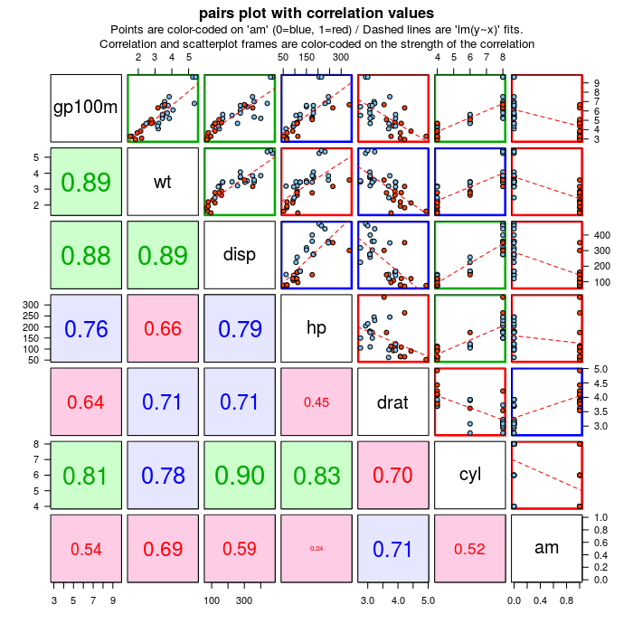
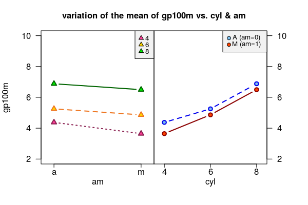
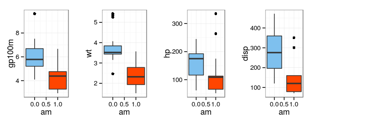
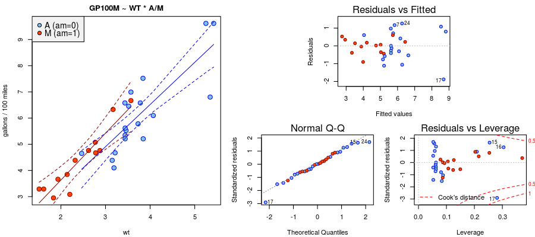
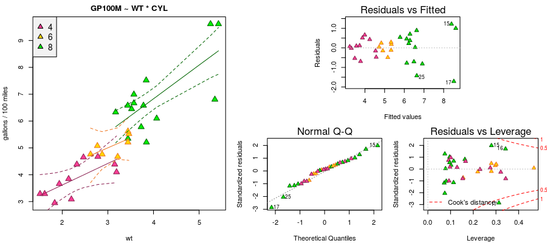
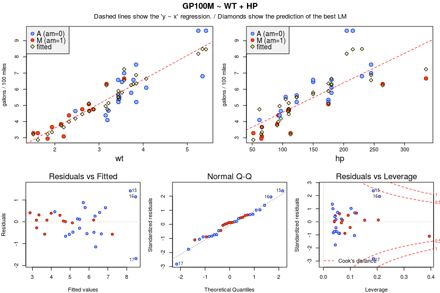

# Manual cars more fuel efficient: myth or reality?
Giovanni Fossati  


### PREAMBLE

Report for assignment of the [_Regression Models_](https://www.coursera.org/course/regmods) 
course of the Coursera/JHSPH Data Science Specialization.    
The source files are posted on [GitHub](https://github.com/pedrosan/DS_specialization/tree/master/MTcars).


## INTRODUCTION

In this report we address a long-debated and controversial issue concerning the fuel 
economy of automobiles with automatic or manual transmission: 

* Which one is better in terms of MPG?  
* How much is the difference?

We analyzed design and performance data for a sample of 32 car models, european
and american, high-end and economy, and can offer you some interesting points 
clarifying the fuel economy vs. transmission issue beyond common wisdom, urban
legends, and _philosophical_ biases ;-)

## Executive Summary

A naive analysis, _not controlling_ for other car features and performance metrics, 
would suggest that manual cars are more fuel-efficient, by about 7.2 
miles per gallon, at a 99.86% confidence level 
(_2-sample t-test, 2-sided_).  
However, this assessment does not take into any consideration the heterogeneity
of car models. 
Assuming that the data at our disposal are representative of the general car
"population", our linear regression analysis leads us to conclude that in fact __there is
NOT any significant difference in fuel efficiency between cars with automatic
and manual transmission__.   
Most of the difference (variance) in fuel efficiency can be explained in terms 
of car weight and engine power.  

The apparent better fuel economy of manual transmission emerges from a strong
relationship between type of transmission and several other features (_e.g._
the cars with automatic transmission tend to be heavier, have larger and more
powerful engines).   
Once the effect of these other "physical" factors is removed there is no
residual difference between automatic and manual cars. 
This could actually be appreciated already by looking at the subset of cars in
the narrow middle range of parameter values where both types of cars are present.

In the remainder of the report we summarize the methods and findings.
Plots are presented in the Appendix.    
This report is being produced with a "live" R-markdown document, that
I will post on my [GitHub repo](https://github.com/pedrosan).

## Data, Selection and Processing

The dataset comprises 32 car models.
For each of them it reports its gas mileage in miles per gallon (MPG) and 
10 other features encompassing various aspects of engine/powertrain design
and measures of performance.
Of the 10 potential _predictors_, five can be regarded as categorical either
directly (_e.g._ `am`) or effectively (_e.g._ `carb`), and we treated them as _factors_.
The other five take continuous numeric values.  

**MPG** and **GP100M**: we performed our analysis on a transformed variable instead
of directly on `mpg`, defining _gallons per 100 miles_ (`gp100m <- 100/mpg`).  
We decided to do this because `mpg`'s relationship with most continuous
variables exhibits a marked curvature, which can potentially be an issue given
our intent of working with linear models and hence it would recommend to
transform the variables to mitigate its effect.
The new variable exhibits much more "regular" (_i.e._ straighter) relationships
with the predictors.
Moreover, and likely related to the straightening of the relationships, `gp100m` 
_more transparently_ represents what truly is the most important variable in the
analysis, that is the amount of fuel used by a car.  
It is also more intepretable with respect to many of the predictors: a
_back-of-the-envelope_ argument about $\text{energy} \propto \text{force}
\times \text{distance}$, and in turn $\text{force} \propto \text{weight}$ would
provide an explanation of the correlation between `gp100m` and `wt` (car weight).
Also, correlations of `gp100m` with `disp` (the engine displacement volume) and
`hp` (engine power) could be fairly promptly interpreted because both variables
can be expected to have a proportional effect on fuel efficiency expressed in this way.

We first reviewed the relationship between the 10 variables by means of _pairs
plots_ (see Appendix) and correlation analyses, looking for potentially significant trends,
such as correlations or noticeable differences between the two groups of
_automatic_ and _manual_ transmission cars (coded in the `am` factor).

Based on this preliminary review, for what concerns categorical variables we
decided to limit our analyses to `am` and `cyl` and to leave out `vs`, `gear` and `carb`.
Among the continuous variables we left out `qsec` (the 1/4 mile time) because it did
not show any significant relationship with any other variable, except with `hp` which 
is not surprising given `qsec` depends very directly on short-duration
acceleration, hence engine power.

## Findings

### Exploratory Analysis : General Trends and Correlations

As the __pairs-plot__ shows `gp100m` is strongly correlated with `wt` and `disp`, 
and between the two selected categorical variables `cyl` seems to exert a stronger
influence than `am`.   
This is illustrated also by the __interaction plots__ showing that the mean `gp100m` 

* within each `cyl` group is basically independent on `am`, and that
* its offset between automatic and manuals cars in each `cyl` group is very small.   

The __boxplots__ further highlights that all "important" continuous variables
exhibit systematic differences between `am` groups, similarly to `gp100m`, thus
suggesting that the apparent correlation between these latter may not be truly
a fundamental characteristic of automobiles.


### Linear Regression Models

In this short report we focus on the results of the analysis based on what emerged
as the most important continuous variables, `wt` and `hp`, combined with the two
factor variables `am` and `cyl`.
In particular we discuss three groups of models for explaining the variation in fuel efficiency, all
based on a baseline model with `wt` as sole predictor.  They are:

1. car weight with possible effect of type of transmission (`gp100m ~ wt*am`).
2. car weight with possible effect of number of cylinders (`gp100m ~ wt*cyl`).
3. car weight and engine power (`gp100m ~ wt + hp`).

In each case we look at the model incrementally, for instance including only `wt`, the 
adding `am`, and finally adding the interaction between them (i.e. allowing for
different slopes for each category-group).

In the models of __Case #1__ the addition of `am`, even with interaction, is not accompanied by 
a statistically significant improvement, as it can be summarized 
by the adjusted-$R^2$ metric, which is 
0.785, 
0.79.
0.783, respectively.
The _analysis of variance_ of the nested models gives a $P(>F)$ of 
0.216 and 
0.68
for the `wt + am` and `wt*am` models.    
The type of transmission has basically no influence on the regression of `gp100m` on `wt`.   
The model is quite good, as illustrated by the _summary diagnostic plots_: 
it is worth noting that the residuals are distributed similarly for both `am` groups,
visually showing that there is no additional "explanatory" effect by `am` after the
effect of `wt` is subtracted.

_Note on MPG_: it is interesting to note that in the case of `mpg` because of
the curvature of its relationship with `wt`, which can be reasonably well
approximated by two branches with different slopes, the addition of the
interaction with `am` improves the model significantly.   Our impression is
that this is an artefact of the less-than-ideal nature of `mpg` as the response
variable. `am` just happens to be a fortunately convenient variable to split
the data in two groups that allow to approximate well the non-linear
relationship between `mpg` and `wt`.   If the dataset had a larger overlap 
between automatic and manual transmission cars, both types extending into the
_other_ end of the dataset, it is likely that `am` will no longer be such a savior.

__Case #2__ looks at the influence of `cyl` instead of `am`.
Again, we compared a sequence of nested models `wt`, `wt + cyl`, `wt*cyl`.
The adjusted-$R^2$ metric values are 
0.785 (same as above, being the same _base model_), 
0.812.
0.806, respectively, a modest improvement
over the previous case.
The _analysis of variance_ of the nested models gives a $P(>F)$ of 
0.062 and 
0.589 which suggests that albeit at
low statistical significance, in this case the addition of the factor variable
does improve the model, but the extension with the interaction term 
does not yield any further improvement.

The models in final set, __Case #3__, are based on `wt` and `hp` only, one model
with each of the separately, and one with them combined (no interaction).
The adjusted-$R^2$ values are 
0.785 (this is again the same _base model_), 
0.568.
0.837, for `wt`, `hp` and `wt + hp` respectively.
The model with `hp` alone provides a pretty poor fit, but the combined model achieves
the highest reduction in variance of all the models we have tested that have up
to three terms in the linear model (including possible interactions).

The _analysis of variance_ of the nested `wt` and `wt+hp` models gives a $P(>F)$ of 
0.003 which tells us that indeed the
improvement of the model with addition of `hp` is statistically significant.

It is possible that a model with additional predictors might improve over the
`wt+hp`, however looking at the regression plot and at the residuals plot, it
is clear that there is no room left for a possible significant effect on
`gp100m` explainable with `am`, which is the main issue of interest of this analysis.

The summary of the best model is the following

```r
printStats.cpt(m2c2)
# MODEL : gp100m ~ wt + hp
#       : adj. R^2 = 0.8365 /  F-stats: 80.326 on 2,29 Df,  p-value: 1.4941e-12
#               Estimate     Std. Error   Pr(>|t|)     Signif
# (Intercept)   6.3051e-01   4.0936e-01   1.3435e-01         
# wt            1.1485e+00   1.6201e-01   8.4494e-08   ***   
# hp            7.4793e-03   2.3120e-03   3.0345e-03   **
```
The model has the form: 
$$\text{gp100m} = 0.6305135 + 1.1485252~\text{wt} + 0.0074793~\text{hp}$$ 
or better still, shifting the reference point (_origin_) to `wt=2` and `hp=100` and scaling `hp` to 100:   
$$\text{gp100m} = 3.6754925 + 1.1485252~(\text{wt}-2) + 0.7479286~(\text{hp}-100)/100$$
The fuel consumption in _gallons/100miles_ of a car of 2000 lbs (`wt=2`) and 100 HP (`hp=100`) is predicted to be about 
3.68 and to increase by 
1.15 every 1000 lbs. and by 0.75 every 100 HP.
It is important to keep in mind that `wt` and `hp` are correlated, with a slope of around 0.94, 
and therefore the increase in gas consumption will generally be a combination of the two components growing in similar proportions.


<hr class="separator">
<a name="SUPPLEMENTARY_MATERIAL"></a>

## SUPPLEMENTARY MATERIAL

### EXPLORATORY ANALYSIS : GENERAL TRENDS AND CORRELATIONS

#### PAIRS PLOTS

For the subset of variables on which we focused our analysis.   
The upper-right panels show the `y~x` scatterplots, with a `lm` line overlayed. 
Colors correspond to the `am` category, blue for automatic (`am=0`) and red for
manual (`am=1`) (this color coding on `am` applies to all plots in this report).
The lower-left panels report the (absolute) value of the correlation coefficients `cor(x,y)`,
and text and background colors are coded to highlight its values (the color of the frame
of the corresponding `y~x` plot is also colored accordingly).


```r
par(mar=c(5, 4, 4, 1)+0.1)
par(oma=c(0, 0, 0, 0))
pairs(mtcars[,c("gp100m","wt","disp","hp","drat","cyl","am")], gap=0.5, pch=21, bg=cvec.fill.am, 
      las=1, panel=mypanel, lower.panel=function(...) panel.cor(..., color.bg=TRUE), main="")
mtext(side=3, "pairs plot with correlation values", outer=TRUE, line=-1.2, font=2)
mtext(side=3, "Points are color-coded on 'am' (0=blue, 1=red) / Dashed lines are 'lm(y~x)' fits.\nCorrelation and scatterplot frames are color-coded on the strength of the correlation", outer=TRUE, line=-1.6, padj=1, cex=0.8, font=1)
```



#### INTERACTION PLOTS: <tt>gp100m</tt>, by <tt>cyl</tt> and <tt>am</tt>

Mean `gp100m` for the six groups resulting from the "interaction" between `am` and `cyl`.


```r
par(mfrow = c(1, 2), oma=c(0, 0, 0, 0), mar=c(4, 4, 3, 0), las=1)
interaction.plot(mtcars$am, mtcars$cyl, mtcars$gp100m, type="b", 
                 pch=pch.cyl, lwd=2, col=colors.cyl, bg=colors.fill.cyl, 
                 ylim=c(2,10), xaxt="n", xlab="", ylab="gp100m", legend=FALSE)
axis(side=1, at=c(1,2), tck=-0.03, labels=NA)
axis(side=1, at=c(1,2), labels=c("a","m"), lwd=0, line=-0.75)
mtext(side=1, "am", line=1.2, font=1)
legend("topright", bty="o", bg="grey95", x.intersp=1.0, y.intersp=0.8, horiz=FALSE, adj=c(0.6), 
       legend=c("4","6","8"), cex=0.8, pch=pch.cyl, pt.bg=colors.fill.cyl, pt.cex=0.9)

par(mar=c(4, 0, 3, 4))
interaction.plot(mtcars$cyl, mtcars$am, mtcars$gp100m, type="b", yaxt="n", 
                 pch=pch.am, lwd=2, col=colors.am,  bg=colors.fill.am,  
                 ylim=c(2,10), xaxt="n", xlab="", ylab="gp100m", legend=FALSE)
axis(4)
axis(side=1, at=c(1,2,3), tck=-0.03, labels=NA)
axis(side=1, at=c(1,2,3), labels=c("4","6","8"), lwd=0, line=-0.75)
mtext(side=1, "cyl", line=1.2, font=1)
legend("topright", bty="o", bg="grey95", x.intersp=1.0, y.intersp=0.8, horiz=FALSE, adj=c(0.1), 
       legend=c("A (am=0)", "M (am=1)"), cex=0.8, pch=pch.am, pt.bg=colors.fill.am, pt.cex=0.9)

mtext("variation of the mean of gp100m vs. cyl & am", side=3, outer=TRUE, line=-2, font=2)
```



```r

par(yaxt="s", mfrow = c(1, 1), oma=c(0, 0, 0, 0), mar=c(5, 4, 4, 1)+0.1)
```


#### BOXPLOTS of <tt>gp100m</tt>, <tt>wt</tt>, <tt>hp</tt>, <tt>disp</tt> vs. <tt>am</tt>


```r
p.base <- theme_bw() + theme(legend.position="none") 

p.gp100m <- ggplot(mtcars, aes(am, gp100m)) + p.base + geom_boxplot(aes(fill=amFac)) + 
                    scale_fill_manual(values = colors.fill.am)
p.wt     <- ggplot(mtcars, aes(am, wt))     + p.base + geom_boxplot(aes(fill=amFac)) + 
                    scale_fill_manual(values = colors.fill.am)
p.hp     <- ggplot(mtcars, aes(am, hp))     + p.base + geom_boxplot(aes(fill=amFac)) + 
                    scale_fill_manual(values = colors.fill.am)
p.disp   <- ggplot(mtcars, aes(am, disp))   + p.base + geom_boxplot(aes(fill=amFac)) + 
                    scale_fill_manual(values = colors.fill.am)

grid.arrange(p.gp100m, p.wt, p.hp, p.disp, ncol=5)
```




<hr />

### LINEAR REGRESSION MODELS

#### 1. <tt> gp100m </tt> vs. <tt> wt </tt> by <tt> am </tt>  (with interaction)


```r
printStats(m2a0, with.cx=FALSE)
```

```
# MODEL        : gp100m ~ wt
# SUMMARY STATS: R^2 = 0.7919  (adj. = 0.7850)
#                F-stats: 114.168 on 1 and 30 DF,  p-value: 9.565824e-12
```

```r
printStats(m2a1, with.cx=FALSE)
```

```
# MODEL        : gp100m ~ wt + amFac
# SUMMARY STATS: R^2 = 0.8031  (adj. = 0.7895)
#                F-stats: 59.147 on 2 and 29 DF,  p-value: 5.836149e-11
```

```r
printStats(m2a2, with.cx=TRUE)
```

```
# MODEL        : gp100m ~ wt + amFac + wt * amFac
# SUMMARY STATS: R^2 = 0.8043  (adj. = 0.7834)
#                F-stats: 38.365 on 3 and 28 DF,  p-value: 4.726005e-10
# 
#               Estimate      Std. Error    Pr(>|t|)      Signif
# (Intercept)    6.9961e-02    8.9098e-01    9.3797e-01         
# wt             1.6118e+00    2.3178e-01    1.4651e-07   ***   
# amFac1        -1.6671e-02    1.2580e+00    9.8952e-01         
# wt:amFac1      1.7764e-01    4.2621e-01    6.8001e-01
```


```r
anova(m2a0, m2a1, m2a2)
# Analysis of Variance Table
# 
# Model 1: gp100m ~ wt
# Model 2: gp100m ~ wt + amFac
# Model 3: gp100m ~ wt + amFac + wt * amFac
#   Res.Df    RSS Df Sum of Sq      F Pr(>F)
# 1     30 17.402                           
# 2     29 16.465  1   0.93699 1.6033 0.2159
# 3     28 16.363  1   0.10152 0.1737 0.6800
```


```r
# layout(matrix(shape, 2, 7, byrow = TRUE))
layout(mat.layout1)

par(mar=c(4, 4, 2, 1)+0.1)
plot(mtcars$wt, mtcars$gp100m, pch=pch.am, col=cvec.am, bg=cvec.fill.am, 
     xlab="wt", ylab="gallons / 100 miles", main="GP100M ~ WT * A/M", 
     cex=1.5)
# abline(c(m2a0$coeff[1],m2a0$coeff[2]), col="green2", lty=4, lwd=3)
addPredConf.am(m2a2, data=mtcars, x="wt", col=colors.am)
legend("topleft", bty="y", bg="grey95", x.intersp=0.7, y.intersp=0.8, legend=c("A (am=0)", "M (am=1)"), 
       cex=1.25, pch=pch.am, pt.bg=colors.fill.am, pt.cex=1.25)

par(mar=c(4, 4, 2, 1)+0.1)
plot(m2a2, which=c(1,2,5), add.smooth=FALSE, pch=pch.am, 
     col=cvec.am, bg=cvec.fill.am, labels.id=1:nrow(mtcars))
```



<hr />

#### 2. <tt> gp100m </tt> vs. <tt> wt </tt> by <tt> cyl </tt>  (with interaction) 


```r
printStats(m2b0, with.cx=FALSE)
```

```
# MODEL        : gp100m ~ wt
# SUMMARY STATS: R^2 = 0.7919  (adj. = 0.7850)
#                F-stats: 114.168 on 1 and 30 DF,  p-value: 9.565824e-12
```

```r
printStats(m2b1, with.cx=FALSE)
```

```
# MODEL        : gp100m ~ wt + cylFac
# SUMMARY STATS: R^2 = 0.8306  (adj. = 0.8125)
#                F-stats: 45.774 on 3 and 28 DF,  p-value: 6.354498e-11
```

```r
printStats(m2b2, with.cx=TRUE)
```

```
# MODEL        : gp100m ~ wt + cylFac + wt * cylFac
# SUMMARY STATS: R^2 = 0.8374  (adj. = 0.8061)
#                F-stats: 26.780 on 5 and 26 DF,  p-value: 1.757956e-09
# 
#               Estimate      Std. Error    Pr(>|t|)      Signif
# (Intercept)    2.0131e+00    9.4331e-01    4.2431e-02   *     
# wt             8.0238e-01    4.0152e-01    5.6234e-02   .     
# cylFac6        7.6724e-01    2.7630e+00    7.8345e-01         
# cylFac8       -2.0501e-01    1.4293e+00    8.8705e-01         
# wt:cylFac6    -6.1713e-02    9.2068e-01    9.4707e-01         
# wt:cylFac8     4.5270e-01    4.8060e-01    3.5489e-01
```


```r
anova(m2b0, m2b1, m2b2)
```

```
# Analysis of Variance Table
# 
# Model 1: gp100m ~ wt
# Model 2: gp100m ~ wt + cylFac
# Model 3: gp100m ~ wt + cylFac + wt * cylFac
#   Res.Df    RSS Df Sum of Sq      F  Pr(>F)  
# 1     30 17.402                              
# 2     28 14.163  2    3.2384 3.0960 0.06222 .
# 3     26 13.598  2    0.5655 0.5407 0.58877  
# ---
# Signif. codes:  0 '***' 0.001 '**' 0.01 '*' 0.05 '.' 0.1 ' ' 1
```


```r
# layout(matrix(shape, 2, 7, byrow = TRUE))
layout(mat.layout1)

par(mar=c(4, 4, 2, 1)+0.1)
plot(mtcars$wt, mtcars$gp100m, pch=pch.cyl, col=cvec.cyl, bg=cvec.fill.cyl, 
     xlab="wt", ylab="gallons / 100 miles", main="GP100M ~ WT * CYL", cex=1.5)
addPredConf.cyl(m2b2, data=mtcars, x="wt", col=colors.cyl)
legend("topleft", bty="y", bg="grey95", legend=c("4","6","8"), cex=1.25, 
       pch=pch.cyl, pt.bg=colors.fill.cyl, pt.cex=1.25)

par(mar=c(4, 4, 2, 1)+0.1)
plot(m2b2, which=c(1,2,5), add.smooth=FALSE, pch=pch.cyl, col=cvec.cyl, bg=cvec.fill.cyl, 
     labels.id=1:nrow(mtcars))
```



<hr />


#### 3. <tt> gp100m </tt> vs. <tt> wt </tt> & <tt> hp </tt>


```r
printStats(m2c0, with.cx=FALSE)
```

```
# MODEL        : gp100m ~ wt
# SUMMARY STATS: R^2 = 0.7919  (adj. = 0.7850)
#                F-stats: 114.168 on 1 and 30 DF,  p-value: 9.565824e-12
```

```r
printStats(m2c1, with.cx=FALSE)
```

```
# MODEL        : gp100m ~ hp
# SUMMARY STATS: R^2 = 0.5821  (adj. = 0.5682)
#                F-stats: 41.786 on 1 and 30 DF,  p-value: 3.839208e-07
```

```r
printStats(m2c2, with.cx=FALSE)
```

```
# MODEL        : gp100m ~ wt + hp
# SUMMARY STATS: R^2 = 0.8471  (adj. = 0.8365)
#                F-stats: 80.326 on 2 and 29 DF,  p-value: 1.4941e-12
```

```r
# printStats(m2c3, with.cx=FALSE)
# printStats(m2c4, with.cx=FALSE)
```


```r
anova(m2c0, m2c2)
```

```
# Analysis of Variance Table
# 
# Model 1: gp100m ~ wt
# Model 2: gp100m ~ wt + hp
#   Res.Df    RSS Df Sum of Sq      F   Pr(>F)   
# 1     30 17.402                                
# 2     29 12.787  1    4.6144 10.465 0.003034 **
# ---
# Signif. codes:  0 '***' 0.001 '**' 0.01 '*' 0.05 '.' 0.1 ' ' 1
```


```r
m2c2.pred.conf <- predict(m2c2, interval="confidence", newdata=mtcars)
cfit1 <- "black"
cfit2 <- rgb(1.0, 1.0, 0.0, 0.3)
par(mar=c(5, 4, 4, 1)+0.1)

# layout(matrix(shape, 5, 6, byrow = TRUE))
layout(mat.layout2)

plot(mtcars$wt, mtcars$gp100m, pch=pch.am, col=cvec.am, bg=cvec.fill.am, xaxt="n", 
     xlab="", ylab="gallons / 100 miles", main="", cex=1.5)
axis(side=1, tck=-0.02, labels=NA)
axis(side=1, lwd=0, line=-0.5)
mtext(side=1, "wt", line=2.0, font=1)
abline(c(m2c0$coeff[1],m2c0$coeff[2]), col=2, lty=2)
points(mtcars$wt, m2c2.pred.conf[,1], pch=23, col=cfit1, bg=cfit2, cex=1.2)
legend("topleft", bty="y", bg="grey95", x.intersp=0.7, y.intersp=0.8, 
       legend=c("A (am=0)", "M (am=1)", "fitted"), cex=1.25, pch=c(pch.am, 23), 
       col=c(colors.am, cfit1), pt.bg=c(colors.fill.am, cfit2), pt.cex=1.25)
mtext(side=3, "GP100M ~ WT + HP", outer=TRUE, line=-1.6, font=2)
mtext(side=3, "Dashed lines show the 'y ~ x' regression. / Diamonds show the prediction of the best LM", 
      outer=TRUE, line=-2.4, padj=1, cex=0.8, font=1)

plot(mtcars$hp, mtcars$gp100m, pch=pch.am, col=cvec.am, bg=cvec.fill.am, xaxt="n", 
     xlab="", ylab="gallons / 100 miles", main="", cex=1.5)
axis(side=1, tck=-0.02, labels=NA)
axis(side=1, lwd=0, line=-0.5)
mtext(side=1, "hp", line=2.0, font=1)
abline(c(m2c1$coeff[1],m2c1$coeff[2]), col=2, lty=2)
points(mtcars$hp, m2c2.pred.conf[,1], pch=23, col=cfit1, bg=cfit2, cex=1.2)
legend("topleft", bty="y", bg="grey95", x.intersp=0.7, y.intersp=0.8, 
       legend=c("A (am=0)", "M (am=1)", "fitted"), cex=1.25, pch=c(pch.am, 23), 
       col=c(colors.am, cfit1), pt.bg=c(colors.fill.am, rgb(1.0, 0.84, 0.0, 0.5)), pt.cex=1.25)

par(mar=c(4, 4, 1, 1))
plot(m2c2, which=c(1,2,5), add.smooth=FALSE, pch=pch.am, col=cvec.am, bg=cvec.fill.am, 
     labels.id=1:nrow(mtcars))
```




<hr class="separator">
<a name="APPENDIX"></a>

# APPENDIX

### Some handy functions


Additional locally defined functions, sourced from the external file.

```r
colors.am <- c("blue2","red2"); 
colors.fill.am <- c("skyblue2","red"); 
cvec.am <- ifelse(mtcars$am==0, colors.am[1], colors.am[2])
cvec.fill.am <- ifelse(mtcars$am==0, colors.fill.am[1], colors.fill.am[2])

colors.cyl <- c("blue2","green2","red2"); 
colors.fill.cyl <- c("skyblue2","green","red"); 
cvec.cyl <- ifelse(mtcars$cyl==4, colors.cyl[1], ifelse(mtcars$cyl==6, colors.cyl[2], colors.cyl[3]))
cvec.fill.cyl <- ifelse(mtcars$cyl==4, colors.fill.cyl[1], ifelse(mtcars$cyl==6, colors.fill.cyl[2], colors.fill.cyl[3]))

printStats <- function (m, with.cx=TRUE) {
    if (class(m) != "lm") stop("Not an object of class 'lm' ")
    f <- summary(m)$fstatistic
    p <- pf(f[1], f[2], f[3], lower.tail=FALSE)
    attributes(p) <- NULL
    
    fml <- as.character(formula(m))
    cx <- summary(m)$coeff
    stars <- rep(" ", nrow(cx))
    stars[cx[,4] <= 0.1] <- "."
    stars[cx[,4] <= 0.05] <- "*"
    stars[cx[,4] <= 0.01] <- "**"
    stars[cx[,4] <= 0.001] <- "***"
    cat("MODEL        : ", sprintf("%s", paste(fml[c(2,1,3)], sep=" ", collapse=" ")), "\n", sep="")
    cat("SUMMARY STATS: ")
    cat("R^2 = ",sprintf("%6.4f",summary(m)$r.squared), "  (adj. = ", sprintf("%6.4f",summary(m)$adj.r.squared), ")", sep="")
    cat("\n")
    cat("               ")
    cat("F-stats: ", sprintf("%.3f",f[1]), " on ", f[2], " and ", f[3], " DF,  p-value: ", p, "\n", sep="")
    # cat("R^2 = ",sprintf("%6.4f",summary(m)$r.squared), "   (adj. = ", sprintf("%6.4f",summary(m)$adj.r.squared), ")\n", sep="")
    # cat("\n")
    # cat("F-statistics : ", f[1], " on ", f[2], " and ", f[3], " DF,  p-value: ", p, "\n", sep="")
    if( with.cx ) {
        #cat("PARAMETERS   :\n")
        cat("\n")
        print(cbind(format(cx[,c(1,2,4)], scientific=TRUE, justify="right", digits=5), Signif=stars), quote=FALSE, print.gap=3)
    }
}

printStats.cpt <- function (m, with.cx=TRUE) {
    if (class(m) != "lm") stop("Not an object of class 'lm' ")
    f <- summary(m)$fstatistic
    p <- pf(f[1], f[2], f[3], lower.tail=FALSE)
    attributes(p) <- NULL
    
    fml <- as.character(formula(m))
    cx <- summary(m)$coeff
    stars <- rep(" ", nrow(cx))
    stars[cx[,4] <= 0.1] <- "."
    stars[cx[,4] <= 0.05] <- "*"
    stars[cx[,4] <= 0.01] <- "**"
    stars[cx[,4] <= 0.001] <- "***"
    cat("MODEL : ", sprintf("%s", paste(fml[c(2,1,3)], sep=" ", collapse=" ")), "\n", sep="")
    cat("      : ")
    cat("adj. R^2 = ", sprintf("%6.4f",summary(m)$adj.r.squared), " /  F-stats: ", sprintf("%.3f",f[1]), " on ", f[2],",", f[3], " Df,  p-value: ", p, "\n", sep="")
    if( with.cx ) {
        print(cbind(format(cx[,c(1,2,4)], scientific=TRUE, justify="right", digits=5), Signif=stars), quote=FALSE, print.gap=3)
        cat("\n")
    }
}

panel.cor <- function(x, y, digits = 2, prefix = "", cex.cor, color.bg=FALSE, ...) {
    usr <- par("usr"); on.exit(par(usr))
    par(usr = c(0, 1, 0, 1))
    r <- abs(cor(x, y))
    txt <- format(c(r, 0.123456789), digits = digits)[1]
    txt <- paste0(prefix, txt)
    if(missing(cex.cor)) cex.cor <- 0.8/strwidth(txt)

    cvec.bg <- c(rgb(1.0, 0.8, 0.9) , rgb(0.9, 0.9, 1.0), rgb(0.8, 1.0, 0.8))
    cvec.text <- c("red", "blue", rgb(0.0, 0.67, 0.0))
    i.color <- 1+(r>0.7)+(r>0.8)
    if( color.bg ) {
       ll <- par("usr") 
       rect(ll[1], ll[3], ll[2], ll[4], col=cvec.bg[i.color])
       text(0.5, 0.5, txt, cex = cex.cor * r, col=cvec.text[i.color])
    } else {
       text(0.5, 0.5, txt, cex = cex.cor * r, col=cvec.text[i.color])
    }
}

mypanel <- function(x, y, ...){
   # count <<- count+1 
   # bg <- if(count %in% c(1,4,9,12)) "#FDFF65" else "transparent"    
   cvec.bg <- c(rgb(1.0, 0.8, 0.9) , rgb(0.9, 0.9, 1.0), rgb(0.8, 1.0, 0.8))
   cvec.border <- c("red", "blue", rgb(0.0, 0.67, 0.0))
   r <- abs(cor(x, y))
   i.color <- 1+(r>0.7)+(r>0.8)
   ll <- par("usr") 
   rect(ll[1], ll[3], ll[2], ll[4], border=cvec.border[i.color], lwd=3)
   points(x, y, ... ) 
   ok <- is.finite(x) & is.finite(y)
   if( any(ok) ) { abline(lm(y[ok] ~ x[ok]), col="red", lty=2, ...) }
}

addPredConf <- function(fit, data="mtcars", x="wt", col=c("blue","red")) {
    pred.conf <- predict(fit, interval="confidence", newdata=data)
    ix <- which(colnames(data) == x)
    i.order <- order(data[[ix]])
    df <- data.frame(x=data[[ix]], am=rep(0,nrow(data)), pred.conf)[i.order, ]
    
    lines(cbind(df$x, df$fit)[df$am==0,], col=col[1], lty=1)
    lines(cbind(df$x, df$lwr)[df$am==0,], col=col[1], lty=2)
    lines(cbind(df$x, df$upr)[df$am==0,], col=col[1], lty=2)
}

addPredConf.am <- function(fit, data="mtcars", x="wt", col=c("blue","red")) {
    pred.conf <- predict(fit, interval="confidence", newdata=data)
    ix <- which(colnames(data) == x)
    i.order <- order(data[[ix]])
    df <- data.frame(x=data[[ix]], am=data$am, pred.conf)[i.order, ]
    
    lines(cbind(df$x, df$fit)[df$am==0,], col=col[1], lty=1)
    lines(cbind(df$x, df$lwr)[df$am==0,], col=col[1], lty=2)
    lines(cbind(df$x, df$upr)[df$am==0,], col=col[1], lty=2)
    lines(cbind(df$x, df$fit)[df$am==1,], col=col[2], lty=1)
    lines(cbind(df$x, df$lwr)[df$am==1,], col=col[2], lty=2)
    lines(cbind(df$x, df$upr)[df$am==1,], col=col[2], lty=2)
}

addPredConf.cyl <- function(fit, data="mtcars", x="wt", col=c("blue","green","red")) {
    pred.conf <- predict(fit, interval="confidence", newdata=data)
    ix <- which(colnames(data) == x)
    i.order <- order(data[[ix]])
    df <- data.frame(x=data[[ix]], grp=data$cyl, pred.conf)[i.order, ]
    
    lines(cbind(df$x, df$fit)[df$grp==4,], col=col[1], lty=1)
    lines(cbind(df$x, df$lwr)[df$grp==4,], col=col[1], lty=2)
    lines(cbind(df$x, df$upr)[df$grp==4,], col=col[1], lty=2)
    lines(cbind(df$x, df$fit)[df$grp==6,], col=col[2], lty=1)
    lines(cbind(df$x, df$lwr)[df$grp==6,], col=col[2], lty=2)
    lines(cbind(df$x, df$upr)[df$grp==6,], col=col[2], lty=2)
    lines(cbind(df$x, df$fit)[df$grp==8,], col=col[3], lty=1)
    lines(cbind(df$x, df$lwr)[df$grp==8,], col=col[3], lty=2)
    lines(cbind(df$x, df$upr)[df$grp==8,], col=col[3], lty=2)
}
```


### Color definitions


```r
colors.am <- c("blue2","red4"); 
colors.fill.am <- c("skyblue2","orangered"); 
pch.am <- c(21, 21)
cvec.am <- ifelse(mtcars$am==0, colors.am[1], colors.am[2])
cvec.fill.am <- ifelse(mtcars$am==0, colors.fill.am[1], colors.fill.am[2])

# colors.cyl <- c("blue2","green4","red2"); 
# colors.fill.cyl <- c("skyblue2","green","red"); 
# colors.cyl <- c("violetred4","chocolate2","green4"); 
# colors.fill.cyl <- c("violetred1","orange","green"); 
colors.cyl <- c("violetred4","chocolate2","darkgreen"); 
colors.fill.cyl <- c("violetred1","gold","green2"); 
pch.cyl <- c(24, 24, 24)
cvec.cyl <- ifelse(mtcars$cyl==4, colors.cyl[1], ifelse(mtcars$cyl==6, colors.cyl[2], colors.cyl[3]))
cvec.fill.cyl <- ifelse(mtcars$cyl==4, colors.fill.cyl[1], ifelse(mtcars$cyl==6, colors.fill.cyl[2], colors.fill.cyl[3]))
```


## R Session Info


```r
sessionInfo()
# R version 3.1.3 (2015-03-09)
# Platform: x86_64-pc-linux-gnu (64-bit)
# Running under: Ubuntu 14.04.2 LTS
# 
# locale:
#  [1] LC_CTYPE=en_US.UTF-8       LC_NUMERIC=C               LC_TIME=en_US.UTF-8       
#  [4] LC_COLLATE=C               LC_MONETARY=en_US.UTF-8    LC_MESSAGES=en_US.UTF-8   
#  [7] LC_PAPER=en_US.UTF-8       LC_NAME=C                  LC_ADDRESS=C              
# [10] LC_TELEPHONE=C             LC_MEASUREMENT=en_US.UTF-8 LC_IDENTIFICATION=C       
# 
# attached base packages:
# [1] grid      stats     graphics  grDevices utils     datasets  methods   base     
# 
# other attached packages:
# [1] gridExtra_0.9.1 ggplot2_1.0.1   knitr_1.10.5   
# 
# loaded via a namespace (and not attached):
#  [1] MASS_7.3-40      Rcpp_0.11.6      colorspace_1.2-6 digest_0.6.8     evaluate_0.7    
#  [6] formatR_1.2      gtable_0.1.2     htmltools_0.2.6  labeling_0.3     magrittr_1.5    
# [11] munsell_0.4.2    plyr_1.8.2       proto_0.3-10     reshape2_1.4.1   rmarkdown_0.6.1 
# [16] scales_0.2.4     stringi_0.4-1    stringr_1.0.0    tools_3.1.3      yaml_2.1.13
```
---
